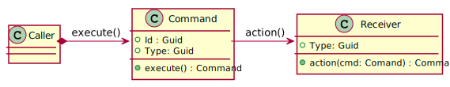

# wEBcMD Documentation

## Index of Types
[wEBcMD Types](../Types/README.md)

## The System


## The way of working

### The simplest relationships


### The detailed Command structure


While the general command objects are designed as pure data transfer objects, the wrappers contain the concrete logic and comfort of the call and execution.

### The very concrete workflow for designing a command

1. We define interface and data structures in an XML file in the Types folder


```xml
<?xml version="1.0" encoding="UTF-8"?>
<Types
	xmlns:xsi="http://www.w3.org/2001/XMLSchema-instance" xsi:noNamespaceSchemaLocation="..\tools\types.xsd">
	<Summary>		
		Detailed Description of the Command-Module.
		Meaning and purpose, intentions and limitations.
	</Summary>
	<ObjectType name="ExampleDTO" category="Samples" id="5c7fc88a-b15a-4a4b-b687-e320c44743de">
		<Summary>Description of the Data-Strucure.</Summary>
		<Base name="BaseDTO" category="Base"/>
		<PropertyType name="One" type="String" summary="First property, a string" />
		<PropertyType name="Two" type="Boolean" summary="Second one, a boolean"/>
	</ObjectType>
	<CommandWrapper name="Example" http="get" category="Samples" id="a84ca129-1d08-4864-a97d-50639b8055d5">
		<Summary>The very first command we designed</Summary>
		<Base name="CommandWrapper" category="Base"/>
		<ParameterType name="Id" type="UuId" modifier="in" summary="The Id of the Data-Object"/>
		<Result type="ExampleDTO" summary="The Data-Object" />
		<DTO name="CommandDTO"/>
	</CommandWrapper>
</Types>
```

2. We run the Code-Generator, to let us create the code skeletons

	The result are two C# files for the serverside code, once the data structure and boilerplate code, second the partial individual implementations.

```
wEBcMD
└───Types
│   │   ExampleTypes.xml
│   │   ExampleTypes.cs
│   
└───Impl
    │   Example.cs
│   
Controlers
    │   ExampleTypesControler.cs
```
##### [Example.cs](../Impl/Example.cs)

The implementation himself. It is generated only if the file does not exist yet. Regeneration can be forced by deleting or renaming the file.
```cs
public partial class ExampleWrapper : CommandWrapper
{
	/// <summary>
	/// The very first command we designed
	/// </summary>

	public partial ExampleDTO Example(Guid id)
	{
		Log.Trace($"Implementation in {MethodBase.GetCurrentMethod()}");
		return default;
	}
};
```

##### [ExampleTypes.cs](../Types/ExampleTypes.cs)
This is the boilerplate part. It is always regenerated.
```cs
/// <summary>
/// Description of the Data-Strucure.
/// </summary>
public class ExampleDTO : BaseDTO
{
	/// <summary>5c7fc88a-b15a-4a4b-b687-e320c44743de is the Id of ExampleDTO type.</summary>
	new public static Guid TypeId { get => System.Guid.Parse("5c7fc88a-b15a-4a4b-b687-e320c44743de"); }
	/// <summary>First property, a string</summary>
	public virtual String One { get; set; }
	/// <summary>Second one, a boolean</summary>
	public virtual Boolean Two { get; set; }
};

...

```
##### [ExampleTypesController.cs](../Controllers/ExampleTypesController.cs)

	If an http command is specified, a controller with the corresponding endpoint is created.
```cs
/// <summary>
/// Detailed Description of the Command-Module. Meaning and purpose, intentions and limitations.
/// </summary>

[ApiController]
[Route("[controller]")]
public class ExampleTypesController : ControllerBase
{
	private readonly ILogger<ExampleTypesController> _logger;
	/// <summary>
	/// Initialize the logger
	/// </summary>
	public ExampleTypesController(ILogger<ExampleTypesController> logger) => _logger = logger;

	/// <summary>
	/// The very first command we designed
	/// </summary>

	[HttpGet]
	[Route("example")]

	public ExampleDTO Example(Guid id)
	{
		ExampleWrapper wrapper = new();

		wrapper.Id = id;

		return wrapper.Example(
				wrapper.Id
		);
	}
}
```

	Furthermore, the client-side typescript classes for the call are generated 
