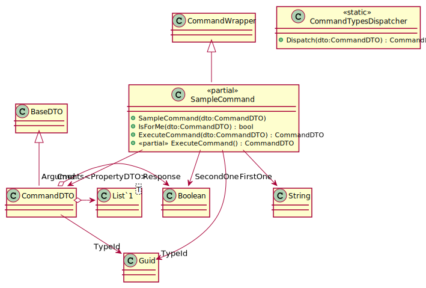

[wEBcMD Commands](../Types/README.md)

### SampleCommand

This is the sample command. He has two Parameters
and a multiline summary.
``` typescript
CommandDTO cmd;
if(SampleCommand.IsForMe(dto)){
   let sample = new SampleCommand(cmd);
   console.log(sample.FirstOne);
}
```

#### Parameters

##### FirstOne

 The FirstOne is a string parameter
 and has a multiline comment

##### SecondOne
The SecondOne is a boolean parameter

#### Class Diagram



[wEBcMD Commands](../Types/README.md)
