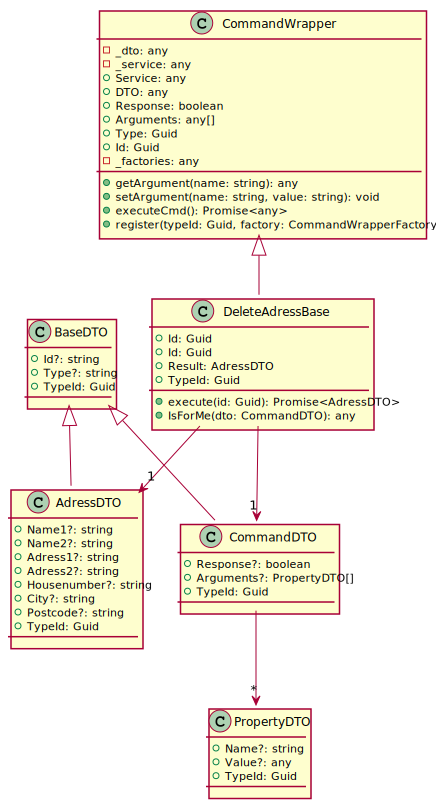

[wEBcMD Documentation](../md.README)

[wEBcMD Types](../../Types/md.README)

## AdressTypes Documentation

      

### Serverside Classes for AdressTypes

### Clientside Classes for AdressTypes

#### Classes for FindAdresses

         

#### Classes for GetAdress

         

#### Classes for SetAdress

         

#### Classes for DeleteAdress

         