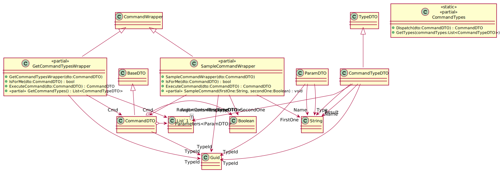

[wEBcMD Documentation](../README.md)

[wEBcMD Types](../../Types/README.md)

## CommandTypes Documentation

      

### Serverside Classes for CommandTypes

### Clientside Classes for CommandTypes

#### Classes for SampleCommand

         