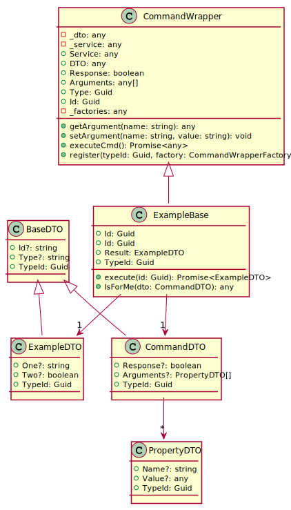

[wEBcMD Documentation](../README.md)

[wEBcMD Types](../../Types/README.md)

## ExampleTypes Documentation

      

### Serverside Classes for ExampleTypes

### Clientside Classes for ExampleTypes

#### Classes for Example

         

#### Classes for EchoValue

         

#### Classes for EchoArguments

         