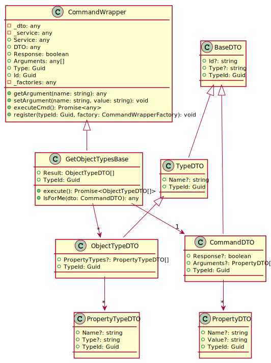

[wEBcMD Documentation](../README.md)

[wEBcMD Types](../../Types/README.md)

## ObjectTypes Documentation

      

### Serverside Classes for ObjectTypes

### Clientside Classes for ObjectTypes

#### Classes for GetObjectTypes

         