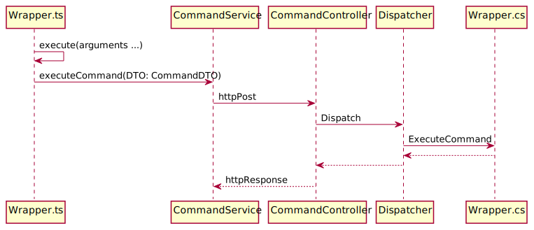

## wEBcMD Commands

[wEBcMD Documentation](../Doc/README.md)

[wEBcMD](../README.md)

### Sequence of a command

### List of all available commands

- [SampleCommand](../Doc/SampleCommand.md)

<!-- THIS IS GENERATED CODE. DO NOT CHANGE THIS SECTION  -->

- [AdressTypes](../Doc/Types/AdressTypes.md)

- [BaseTypes](../Doc/Types/BaseTypes.md)

- [CommandTypes](../Doc/Types/CommandTypes.md)

- [ExampleTypes](../Doc/Types/ExampleTypes.md)

- [ObjectTypes](../Doc/ObjectTypes.md)

<!--- HERE INSERT DOCUMENT LINK --->
<!-- THIS IS GENERATED CODE. DO NOT CHANGE THIS SECTION  -->
